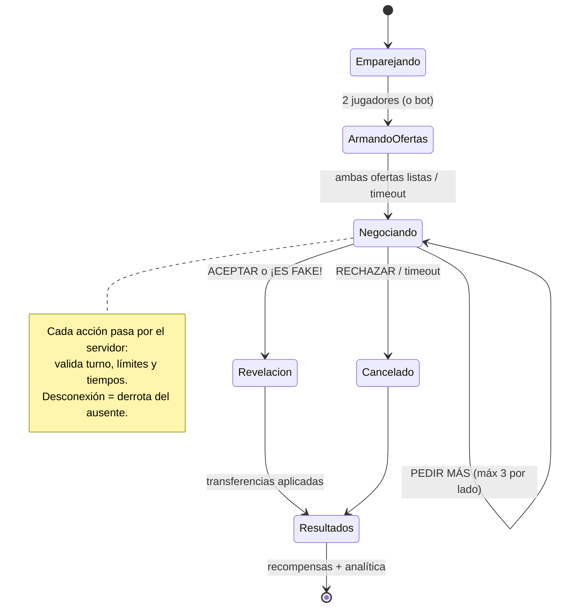
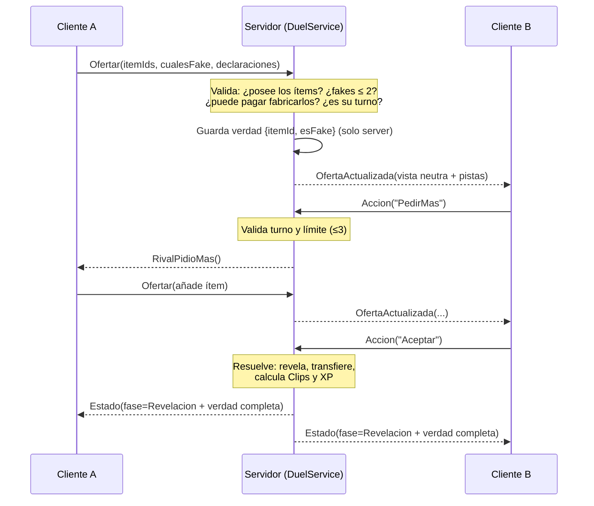

# Arquitectura Técnica — Master of Barter
**Versión 0.1 — Fase 6 · agosto 2026**
Principio rector: la arquitectura más simple que soporte el GDD. Cada pieza está justificada; lo que no aparece aquí, no se necesita en el MVP.

---

## 1. Decisión de herramientas

| Problema | Alternativas | Decisión MVP | Justificación |
|---|---|---|---|
| Editor y flujo de código | Solo Studio · Rojo+VS Code+Git | **Solo Studio al inicio → migrar a Rojo+Git al llegar al Nivel 3 de la ruta** | Aprender el juego y las herramientas a la vez multiplica la fricción. El proyecto es chico; migra bien después. |
| Framework de juego | Knit/otros · patrón propio | **Patrón Servicios/Controladores propio (a mano)** | Entender el patrón antes de adoptar frameworks; cero dependencias externas de arranque. |
| Guardado | DataStore crudo · ProfileStore | **ProfileStore** | Session locking y auto-save resueltos; es el estándar comunitario actual. Única dependencia externa del MVP. |
| Cross-server | MessagingService, MemoryStore | **Ninguno** | Los duelos ocurren dentro de un servidor. No hay leaderboards globales ni matchmaking global en MVP. |

## 2. Servicios de Roblox utilizados

Workspace (lobby y mesas) · ReplicatedStorage (config, remotos, assets compartidos) · ServerStorage (assets privados) · ServerScriptService (código servidor) · StarterPlayer/StarterGui (código y UI cliente) · SoundService · DataStoreService (vía ProfileStore) · MarketplaceService (passes/productos) · TextService (filtro de textos de vitrina). Nada más.

## 3. Estructura del proyecto

```
ReplicatedStorage/
  Shared/
    Config/
      Items.luau        -- catálogo de objetos: id, rareza, valorBase (nombres en Strings)
      Economy.luau      -- costos de fakes, recompensas, precios del kiosco
      DuelRules.luau    -- fases, tiempos, límites (pedirMás=3, fakes=2, ficha=1)
      Theme.luau        -- PIEL INTERCAMBIABLE: assets visuales/sonoros del tema activo
    Types.luau          -- tipos Luau compartidos (ItemId, OfertaView, EstadoDuelo...)
    Remotes/            -- carpeta de RemoteEvents (creados por el servidor al arrancar)
    Util/
      Signal.luau       -- evento simple para comunicación interna
      Trove.luau        -- limpieza de conexiones/instancias

ServerScriptService/
  Main.server.luau      -- bootstrap: carga config, inicia servicios en orden
  Services/
    DataService.luau        -- ProfileStore: cargar/soltar perfiles, API de lectura/escritura
    EconomyService.luau     -- Clips: sumar/restar SIEMPRE por aquí (única puerta)
    InventoryService.luau   -- colección permanente y copias de duelo
    DuelService.luau        -- máquina de estados del duelo; dueño de la verdad real/fake
    MatchmakingService.luau -- cola dentro del servidor; invoca BotService si expira
    BotService.luau         -- rivales bot con personalidades
    ShopService.luau        -- kiosco + MarketplaceService (ProcessReceipt idempotente)
    AnalyticsService.luau   -- eventos personalizados
  ProfileStore.luau     -- (módulo externo auditado)

StarterPlayer/StarterPlayerScripts/
  Main.client.luau      -- bootstrap cliente
  Controllers/
    UIController.luau       -- monta/desmonta pantallas según estado
    DuelController.luau     -- refleja el estado del duelo, envía acciones
    ShopController.luau
    SoundController.luau    -- banco de sonidos desde Theme.luau
    LobbyController.luau

StarterGui/  -- ScreenGuis diseñados en el editor, controlados por UIController
```

**Reglas de dependencia:** Services pueden requerir Services (orden fijado en Main); Controllers nunca requieren Services (solo hablan por remotos); ambos pueden requerir Shared; Shared no requiere a nadie. Config son datos puros sin lógica.

**Por qué `Theme.luau` existe:** es el compromiso arquitectónico de la estrategia evergreen. Todo asset con sabor a "papelito" (imágenes de envoltorio, texturas de mesa, sonidos, nombres de temporada) se referencia a través del tema activo. Cambiar de trend = escribir un tema nuevo, cero cambios de lógica.

## 4. Separación cliente / servidor

| Vive en el SERVIDOR (verdad) | Vive en el CLIENTE (vista) |
|---|---|
| Qué objeto envuelto es real o fake | Solo "objeto envuelto #N con declaración X" |
| Clips, colección, inventario de duelo | Copia de solo-lectura para pintar UI |
| Estado y fase del duelo, turnos, tiempos | Reflejo del estado para animar |
| Resolución de aceptar/acusar/revelar | Animaciones de revelación |
| Precios, costos, recompensas | Nada: los lee de Config para *mostrar*, el server recalcula |

La regla de oro del GDD §39 se implementa así: cuando A ofrece, `DuelService` guarda `{itemId, esFake}` solo en su tabla interna, y replica a B únicamente `{envueltoId, declaracion, pistasVisuales}` — donde `pistasVisuales` son las imperfecciones *pre-calculadas por el servidor* (un fake replica su textura con errata; un real, la normal). El booleano `esFake` jamás viaja al rival.

## 5. Máquina de estados del duelo



Cada duelo es una tabla de estado dentro de `DuelService` con su `Trove` propio: al terminar (por cualquier vía, incluida desconexión), se limpian todas las conexiones y temporizadores. Un watchdog por fase (timeout) garantiza que ningún duelo quede colgado.

## 6. Flujo de remotos (secuencia de una negociación)



**Catálogo de remotos del MVP (todos con rate limit y validación de fase):**
- `Duel/Ofertar`, `Duel/Accion` (Aceptar|Rechazar|PedirMas|AcusarFake), `Duel/EmoteUsado`
- `Matchmaking/EntrarCola`, `Matchmaking/SalirCola`
- `Shop/Comprar` (con Clips) — las compras Robux van por MarketplaceService, no por remotos propios
- Servidor→cliente: `Duel/Estado`, `Player/DatosActualizados`, `Notificacion` — **tres, y no hay un cuarto.**

Sin RemoteFunctions en MVP: todo es evento + respuesta por evento (evita clientes que cuelgan al servidor).

**No existe un remoto `Duel/Revelacion`, y su ausencia es la decisión.** Un borrador de este documento lo listaba; el código mandó la revelación adentro de `Duel/Estado`, con la compuerta de fase, y el código eligió mejor. La revelación es el único objeto replicado que carga `isFake`: darle su propio remoto le da una **segunda salida**, sin compuerta, a la única regla inviolable del proyecto.

El remoto llegó a existir declarado y sin disparar. Eso no es una línea muerta: es un arma cargada sobre la mesa, con el nombre exacto que buscaría quien vaya a implementar la animación de la revelación en Etapa 4. La defensa no es acordarse de no usarlo — es que no exista (ver `decisiones.md`, caso (d)).

## 7. Sistema de datos y esquema de guardado

```lua
-- Plantilla de perfil (DataService)
{
  DataVersion = 1,
  Clips = 0,
  Nivel = 1, XP = 0,
  Coleccion = {},        -- { [itemId] = cantidad } (permanente, nunca decrece por duelos)
  CopiasDuelo = {},      -- { [itemId] = cantidad } (lo que se apuesta y puede perderse)
  Cosmeticos = { Comprados = {}, Equipados = {} },
  Stats = { Duelos = 0, Victorias = 0, FakesColados = 0, FakesCazados = 0 },
  Misiones = { Fecha = "", Progreso = {} },
  Recibos = {},          -- ids de ProcessReceipt ya otorgados (idempotencia)
  Escrow = {},           -- { {itemId, duelId} } copias apostadas y sin resolver
}
```

**Sobre `Escrow` (agregado en B3):** las copias apostadas salen del perfil al **ofertar**, no al resolver. Eso hace que terminar un duelo por desconexión no tenga que escribir nada en el perfil del que se fue, y por lo tanto que no exista carrera entre la transferencia y la liberación del perfil.
Si el servidor se cae a mitad, esas copias se pierden. Es la elección deliberada entre los dos fallos posibles: una pérdida lastima a una persona una vez, una duplicación infla la economía de todos para siempre. Por eso **no hay auto-devolución** — devolver tras una caída ocurrida entre el pago al ganador y la limpieza del perdedor duplicaría.
La lista existe para que esa pérdida sea **detectable**: al cargar un perfil, toda entrada de `Escrow` es huérfana por definición (un duelo vivo no sobrevive a la sesión que lo sostenía), se reporta y se limpia sin devolver. Sin esa lista, "lo perdí en una caída" y "nunca lo tuve" serían el mismo síntoma.

Reglas: ProfileStore gestiona auto-save y session locking; jamás se llama a guardar por cambio pequeño. Toda mutación de Clips pasa por `EconomyService` (un solo lugar para logs, validación y balance). `DataVersion` permite migraciones: al cargar, si la versión es vieja, se ejecutan funciones de migración en cadena. Si un perfil no carga (lock ajeno, error), el jugador entra en modo espectador con aviso y reintento — nunca con datos por defecto que luego sobrescriban los reales.

## 8. Manejo de errores y validaciones

- Todo acceso a servicios externos (DataStore vía ProfileStore, MarketplaceService, TextService) va en `pcall` con reintento y backoff donde aplica.
- Toda entrada de remoto se valida en 4 capas: **tipo** (¿es string/number válido?), **rango** (¿itemId existe en Config?), **estado** (¿hay duelo activo? ¿es su turno? ¿fase correcta?), **permiso/economía** (¿posee el ítem? ¿alcanzan los Clips?). Falla cualquiera → se ignora y se registra en analítica (patrones de spam = candidatos a exploit).
- `ProcessReceipt`: verifica en `Recibos` si ya se otorgó; otorga → guarda → recién entonces devuelve `PurchaseGranted`.
- Errores no capturados del servidor se registran con contexto (duelo, jugador, fase) para depurar con la Developer Console.

## 9. Configuración, eventos y estados

- **Configuración:** todo número balanceable vive en `Shared/Config` (nunca en la lógica). Balancear = editar un módulo.
- **Eventos internos:** `Signal.luau` para comunicación entre servicios (ej. `DuelService` anuncia `DueloTerminado` y `AnalyticsService` + `EconomyService` escuchan) sin acoplarlos.
- **Estados:** la máquina del duelo (§5) es la única FSM del MVP. El cliente tiene un estado de UI simple: `Lobby | EnCola | EnDuelo | Resultados`.

## 10. Interfaz, sonido y analítica

- **UI:** pantallas como ScreenGuis diseñadas en el editor; `UIController` las monta/desmonta según el estado y delega a un módulo por pantalla (`DuelScreen.luau`, `ShopScreen.luau`...). Animaciones con TweenService. Todo en escala + UIAspectRatioConstraint; el emulador móvil es parte del "definition of done" de cada pantalla.
- **Sonido:** `SoundController` carga el banco de sonidos declarado en `Theme.luau` (el tema define QUÉ suena; el controlador, CUÁNDO).
- **Analítica:** `AnalyticsService` expone `registrar(evento, datos)` y envía a Roblox Analytics. Eventos mínimos del MVP: funnel de onboarding paso a paso, duelo iniciado/terminado (con duración, resultado, nº de PedirMás, fakes usados, acusaciones), compra en kiosco, compra Robux. El balance del bluff se decide con estos datos.

## 11. Estrategia de pruebas

1. **Por sistema:** cada servicio se prueba al construirse con un script de escenario (ej. simular 20 ofertas inválidas contra `DuelService`).
2. **Multijugador:** test de 2 clientes en Studio para cada fase del duelo; caso obligatorio: desconexión en cada fase.
3. **Auto-juego de bots:** `BotService` vs `BotService` cientos de duelos seguidos → detecta fugas de memoria, estados colgados y sesgos de balance sin humanos. (Es barato porque los bots ya existen por el arranque en frío.)
4. **Checklist pre-release:** móvil emulado, conexión lenta (simulador de red), Developer Console sin errores, guardado tras cierre abrupto.

## 12. Optimización y actualizaciones

- **Optimización:** juego UI-first en un mapa pequeño — el riesgo es bajo por diseño. Reglas: medir con MicroProfiler antes de optimizar; presupuesto de partículas en la revelación; atlas de imágenes para la UI de papel; StreamingEnabled activo.
- **Actualizaciones:** temporadas = nuevo `Theme` + entradas nuevas en `Items.luau` + misiones — sin tocar sistemas. Migraciones de datos por `DataVersion`. Publicar entre semana en horario de poco tráfico y vigilar la Developer Console la primera hora.

---

*Próximo documento: Fase 7 — Planificación por etapas.*
